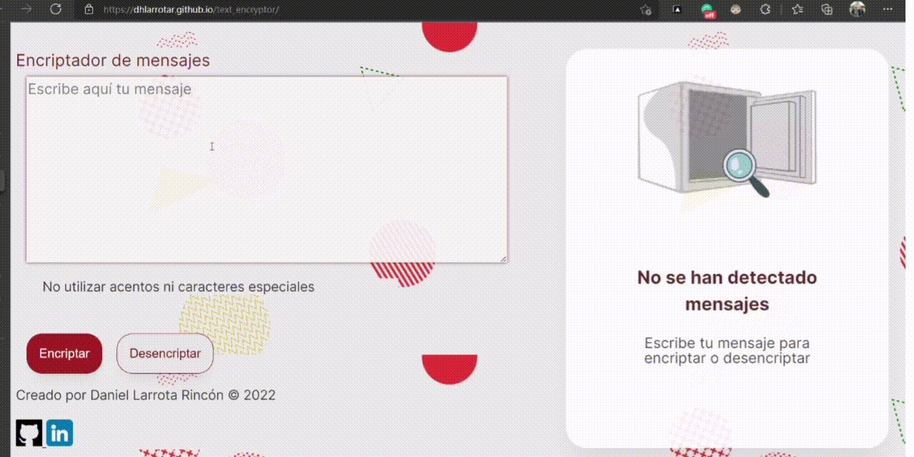
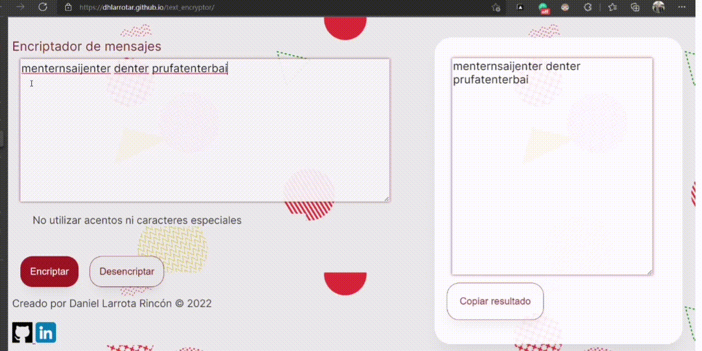

# Text Encryptor -- Encriptador de texto

## Descripción 📉
Aplicación web para encriptar y desencriptar mensajes

## Uso 📦

1 Escribe tu mensaje en el campo indicado  
2 Selecciona el botón encriptar o desencriptar  
3 ¡Tu mensaje secreto está listo! Podrás copiar el resultado al portapapeles en el área indicada.
  

  

## Construido con 🛠️

  

## Probar ahora 🚀
 

## Temas 🎨

Este proyecto fue realizado durante el programa de Oracle Next Education (ONE) como primer desafío de lógica de programación.